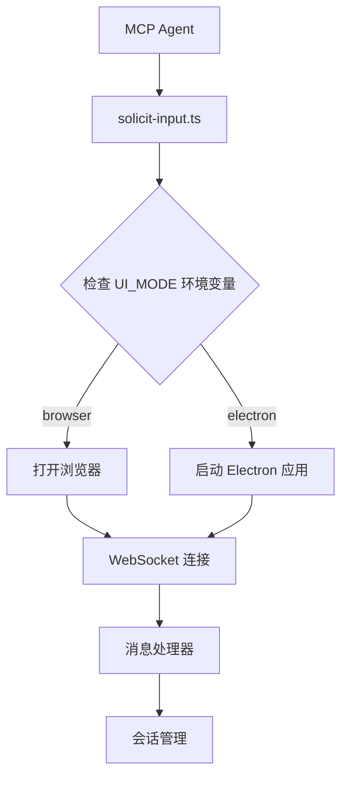
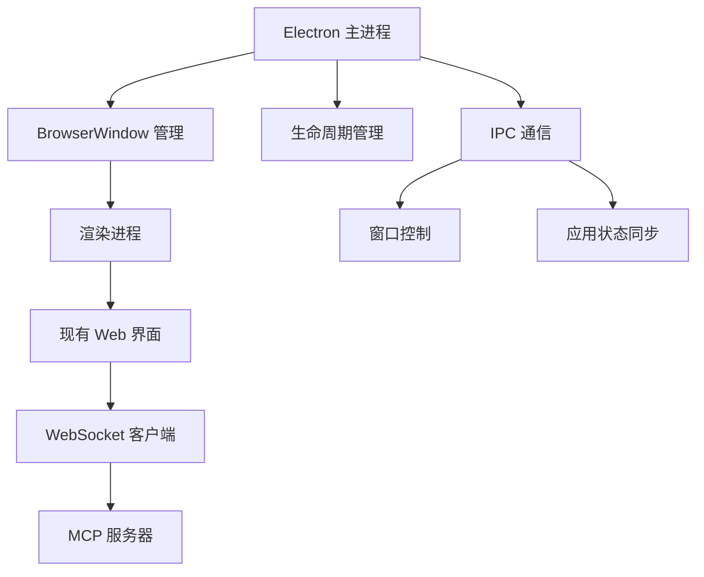

# 设计文档

## 概述

本设计为 Dynamic Interaction MCP 系统添加 Electron GUI 支持，通过环境变量配置允许用户选择使用原生桌面应用程序而不是浏览器进行交互。设计保持与现有 Web 界面的功能对等性，同时提供更好的桌面集成体验。

## 架构

### 高层架构



### Electron 集成架构



## 组件和接口

### 1. 环境变量配置

新增环境变量：
- `UI_MODE`: 控制界面模式，可选值为 `browser`（默认）或 `electron`
- `ELECTRON_WINDOW_WIDTH`: Electron 窗口宽度（默认 1200）
- `ELECTRON_WINDOW_HEIGHT`: Electron 窗口高度（默认 800）

### 2. Electron 应用结构

```
src/electron/
├── main.ts              # Electron 主进程入口
├── preload.ts           # 预加载脚本
├── window-manager.ts    # 窗口管理器
└── lifecycle.ts         # 生命周期管理
```

### 3. 核心组件

#### ElectronLauncher
```typescript
interface ElectronLauncher {
  launch(): Promise<void>;
  isRunning(): boolean;
  close(): Promise<void>;
  focus(): void;
}
```

#### WindowManager
```typescript
interface WindowManager {
  createWindow(): BrowserWindow;
  getWindow(): BrowserWindow | null;
  closeWindow(): Promise<void>;
  focusWindow(): void;
  setupWindowEvents(): void;
}
```

#### LifecycleManager
```typescript
interface LifecycleManager {
  initialize(): Promise<void>;
  shutdown(): Promise<void>;
  handleAppReady(): void;
  handleWindowClosed(): void;
}
```

### 4. 修改现有组件

#### 更新 solicit-input.ts
```typescript
// 新增 UI 模式检测逻辑
const uiMode = process.env.UI_MODE || 'browser';

if (uiMode === 'electron') {
  await launchElectronApp();
} else {
  await openBrowser();
}
```

#### 更新 config.ts
```typescript
// 新增 Electron 相关配置
export const ELECTRON_CONFIG = {
  enabled: process.env.UI_MODE === 'electron',
  windowWidth: Number(process.env.ELECTRON_WINDOW_WIDTH) || 1200,
  windowHeight: Number(process.env.ELECTRON_WINDOW_HEIGHT) || 800,
  devTools: process.env.NODE_ENV === 'development'
};
```

## 数据模型

### Electron 应用状态
```typescript
interface ElectronAppState {
  isRunning: boolean;
  window: BrowserWindow | null;
  sessionId: string | null;
  lastActivity: number;
}
```

### 窗口配置
```typescript
interface WindowConfig {
  width: number;
  height: number;
  title: string;
  webPreferences: {
    nodeIntegration: boolean;
    contextIsolation: boolean;
    preload: string;
  };
}
```

## 错误处理

### 1. Electron 不可用处理
- 检测 Electron 是否已安装
- 如果不可用，记录警告并回退到浏览器模式
- 提供清晰的错误消息指导用户安装 Electron

### 2. 窗口管理错误
- 处理窗口创建失败
- 处理窗口意外关闭
- 实现窗口恢复机制

### 3. 进程通信错误
- IPC 通信失败处理
- 主进程和渲染进程同步错误
- WebSocket 连接在 Electron 环境中的错误处理

## 测试策略

### 1. 单元测试
- ElectronLauncher 组件测试
- WindowManager 功能测试
- 配置解析和验证测试
- 错误处理逻辑测试

### 2. 集成测试
- Electron 应用启动和关闭流程测试
- WebSocket 连接在 Electron 环境中的测试
- 浏览器模式和 Electron 模式切换测试
- 多会话处理测试

### 3. 端到端测试
- 完整的用户交互流程测试
- 图像上传和处理测试
- 会话超时和恢复测试
- 窗口生命周期测试

### 4. 兼容性测试
- 不同操作系统（macOS、Windows、Linux）测试
- 不同 Node.js 版本兼容性测试
- Electron 版本兼容性测试

## 实现细节

### 1. 依赖管理
- 将 Electron 添加为可选依赖（optionalDependencies）
- 实现动态导入以避免在浏览器模式下加载 Electron
- 提供优雅的降级机制

### 2. 构建流程
- 更新构建脚本以支持 Electron 编译
- 确保 Electron 相关代码不影响现有构建
- 添加 Electron 打包配置（可选）

### 3. 开发体验
- 添加开发模式下的 Electron 热重载
- 提供 Electron DevTools 访问
- 集成现有的日志系统

### 4. 性能优化
- 实现 Electron 应用的懒加载
- 优化窗口创建和销毁性能
- 减少内存占用

## 安全考虑

### 1. 渲染进程安全
- 禁用 Node.js 集成
- 启用上下文隔离
- 使用安全的预加载脚本

### 2. IPC 安全
- 验证所有 IPC 消息
- 限制可调用的 API
- 防止代码注入攻击

### 3. 网络安全
- 确保 WebSocket 连接安全
- 验证服务器证书
- 防止中间人攻击

## 部署和分发

### 1. 安装方式
- 保持现有的 npm 全局安装方式
- Electron 作为可选依赖，用户可选择安装
- 提供安装指南和故障排除文档

### 2. 配置管理
- 通过环境变量进行配置
- 支持配置文件（可选）
- 提供配置验证和默认值

### 3. 更新机制
- 保持与现有更新机制的兼容性
- 考虑 Electron 应用的自动更新（未来功能）

## 向后兼容性

- 默认行为保持不变（浏览器模式）
- 现有 API 和配置保持兼容
- 不影响现有用户的工作流程
- 提供平滑的迁移路径