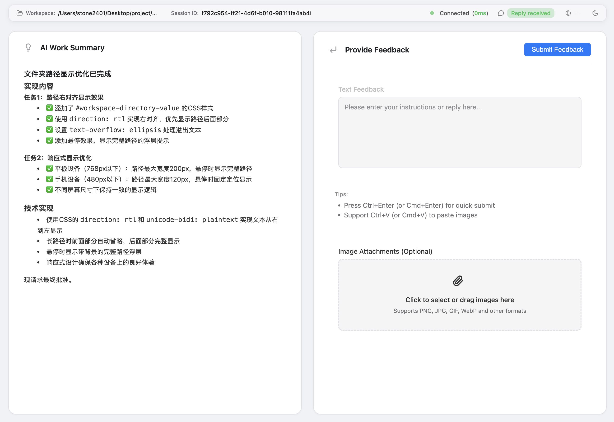

# Dynamic Interaction MCP

  

> [中文文档](./docs/README-zh.md) | English

A Node.js/TypeScript-based interactive AI agent system that provides a rich Web UI for real-time, multimodal interaction between AI models and users. This tool implements the Model Context Protocol (MCP) and is designed for use with AI editors like Cursor, Windsurf, and other intelligent development environments.

## ✨ Features

- **Multi-modal Interaction**: Support for text and image inputs with real-time feedback
- **Dual UI Modes**: 
  - **Browser Mode**: Traditional web interface with browser notifications
  - **Electron Mode**: Native desktop application with enhanced window management
- **Web Notifications**: Browser-native notifications ensure you never miss important messages, even when the tab is in the background
- **Dual MCP Tools**:
  - `solicit-input`: Interactive mode that collects user feedback through a web interface
  - `notify-user`: Notification mode that sends information to users without waiting for response
- **Lazy Server Start**: HTTP server only starts when needed to avoid port conflicts
- **Session Management**: Smart session handling with timeouts and auto-reconnection
- **Real-time Communication**: WebSocket-based live updates between frontend and backend
- **Responsive UI**: Modern, clean interface with dark/light theme support
- **Page Visibility Detection**: Automatically detects when users switch to background tabs
- **Window Focus Management**: Automatic window focusing when interaction is needed (Electron mode)

## 🛠️ Tech Stack

- **Backend**: Node.js, Express.js, TypeScript, WebSocket, Winston
- **Frontend**: TypeScript, HTML5, CSS3, Web Notifications API, Page Visibility API
- **Protocol**: Model Context Protocol (MCP)
- **Libraries**: marked.js, highlight.js, lucide icons

## ⚡ Quick Start

### Prerequisites

- [Node.js](https://nodejs.org/) (version 18+ required)
- [pnpm](https://pnpm.io/) (recommended package manager)

### Installation

1. **Install the package globally:**
   ```bash
   npm install -g dynamic-interaction
   ```

2. **For Electron GUI support (optional):**
   ```bash
   npm install -g dynamic-interaction electron
   ```

3. **Or install from source:**
   ```bash
   git clone https://github.com/stone2401/dynamic-interaction.git
   cd dynamic-interaction
   pnpm install
   
   # For Electron support
   pnpm install electron --save-optional
   
   pnpm run build
   make link  # Links as global CLI tool
   ```

**Note**: Electron is an optional dependency. The system works perfectly in browser mode without Electron installed.

### Usage

**As MCP Server:**
Add to your MCP client configuration (e.g., Claude Desktop):

```json
    "dynamic-interaction": {
      "command": "npx",
      "args": [
        "-y",
        "dynamic-interaction@latest"
      ],
      "env": {}
    },
```

AI Rule add below content:

```Rule
- **Interaction Channel**: All interactions with the user must be conducted through the `dynamic-interaction` interface.
  - **Solicit Input (`solicit-input`)**: This is the **only** way for the AI to initiate any interaction. Whether it's requesting approval, reporting an obstacle, seeking guidance, or asking to conclude the conversation after a task is complete, it must be done through this interface. After calling it, the AI must pause and wait for the user's response.
  - **Notify User (`notify-user`)**: This interface is used to send one-way notifications to the user that do not require an immediate response, such as mid-task progress updates. After calling it, the AI can continue its execution without waiting.
  - **Task Closure Constraint**: The AI is **strictly prohibited** from unilaterally deciding to end the current conversation or task. After all tasks are completed, it must use the `solicit-input` interface.
```



**Direct CLI Usage:**
```bash
# Start the MCP server (browser mode)
dynamic-interaction

# Start in Electron mode
UI_MODE=electron dynamic-interaction

# Development mode
pnpm run dev

# Development with Electron
pnpm run dev:electron

# Build project
pnpm run build

# Start Electron directly (after build)
pnpm run start:electron
```

## 🔧 Configuration

Environment variables can be configured via `.env` file or direct export:

### Basic Configuration

| Variable           | Description                                | Default      |
| ------------------ | ------------------------------------------ | ------------ |
| `PORT`             | HTTP server port                           | `10086`      |
| `SESSION_TIMEOUT`  | Session timeout in seconds                 | `300`        |
| `TIMEOUT_PROMPT`   | Default prompt on session timeout          | `"continue"` |
| `DEFAULT_LANGUAGE` | Default interface language ("zh"、"en" 等) | "zh"         |

### Electron GUI Configuration

| Variable                   | Description                    | Default     |
| -------------------------- | ------------------------------ | ----------- |
| `UI_MODE`                  | UI mode ("browser" or "electron") | `"browser"` |
| `ELECTRON_WINDOW_WIDTH`    | Electron window width          | `1200`      |
| `ELECTRON_WINDOW_HEIGHT`   | Electron window height         | `800`       |

**Note**: Electron mode requires Electron to be installed as an optional dependency. If Electron is not available, the system will automatically fall back to browser mode with a warning message.

### Logging Configuration

| Variable            | Description                                                | Default                       |
| ------------------- | ---------------------------------------------------------- | ----------------------------- |
| `LOG_ENABLED`       | Enable logging system                                      | `false`                       |
| `LOG_DIR`           | Log files storage directory                                | `~/.dynamic-interaction/logs` |
| `LOG_ERROR_FILE`    | Error log filename                                         | `error.log`                   |
| `LOG_COMBINED_FILE` | Combined log filename                                      | `combined.log`                |
| `LOG_LEVEL`         | Log level (error, warn, info, http, verbose, debug, silly) | `info`                        |
| `LOG_COLORIZE`      | Colorized console output                                   | `true`                        |
| `LOG_TO_FILE`       | Output logs to file (requires LOG_ENABLED=true)            | `true`                        |

**Configuration Examples:**

```bash
# Browser mode (default)
PORT=8080 LOG_ENABLED=true dynamic-interaction

# Electron mode with custom window size
UI_MODE=electron ELECTRON_WINDOW_WIDTH=1400 ELECTRON_WINDOW_HEIGHT=900 dynamic-interaction

# Using .env file for configuration
cat > .env << EOF
UI_MODE=electron
ELECTRON_WINDOW_WIDTH=1400
ELECTRON_WINDOW_HEIGHT=900
LOG_ENABLED=true
LOG_LEVEL=info
EOF
dynamic-interaction

# Development mode with Electron
NODE_ENV=development UI_MODE=electron dynamic-interaction

# Production deployment
UI_MODE=electron PORT=10086 LOG_ENABLED=true dynamic-interaction
```

**MCP Client Configuration Examples:**

```json
// Claude Desktop config.json
{
  "mcpServers": {
    "dynamic-interaction": {
      "command": "npx",
      "args": ["-y", "dynamic-interaction@latest"],
      "env": {
        "UI_MODE": "electron",
        "ELECTRON_WINDOW_WIDTH": "1400",
        "ELECTRON_WINDOW_HEIGHT": "900",
        "LOG_ENABLED": "true"
      }
    }
  }
}
```

## 🌟 Key Features

### Web Notifications
The system provides comprehensive notification support:
- **Browser Notifications**: Native browser notifications when the tab is in background
- **Permission Management**: Automatic permission requests and status checking
- **Page Visibility Detection**: Uses Page Visibility API to detect when users switch tabs
- **Smart Notification Logic**: Only shows browser notifications when the page is not visible

### UI Modes

**Browser Mode (Default)**
- Traditional web interface in your default browser
- Browser notifications for background awareness
- Cross-platform compatibility
- No additional dependencies required

**Electron Mode**
- Native desktop application experience
- Enhanced window management and focus control
- Automatic window positioning and sizing
- Better integration with desktop environment
- Requires Electron as optional dependency
- Automatic fallback to browser mode if Electron is unavailable
- Session reuse across multiple interactions
- Improved security with context isolation

### MCP Tools

1. **solicit-input**
   - Opens interactive interface (browser or Electron based on UI_MODE)
   - Supports text and image inputs
   - Real-time session management
   - Automatic cleanup on timeout
   - Window focus management in Electron mode

2. **notify-user**
   - Sends notifications without waiting for user input
   - Shows browser notifications for background users (browser mode)
   - Window focus alerts in Electron mode
   - Customizable notification content

### Architecture Highlights

- **Modular Design**: Clean separation between MCP server, HTTP server, and WebSocket transport
- **Session Management**: Smart session handling with timeouts and cleanup
- **State Management**: Centralized server state management
- **Error Handling**: Comprehensive error handling and graceful degradation
- **Security**: Input validation and sanitization

## 📁 Project Structure

```
src/
├── mcp/           # MCP server implementation
├── server/        # HTTP server and WebSocket handling
├── electron/      # Electron desktop application
│   ├── main.ts    # Electron main process
│   ├── window-manager.ts # Window management
│   ├── lifecycle.ts # Application lifecycle
│   ├── launcher.ts # Electron launcher service
│   └── preload.ts # Preload script for security
├── public/        # Frontend assets
│   ├── ts/        # TypeScript frontend code
│   ├── css/       # Stylesheets
│   └── index.html # Main UI
├── types/         # Shared TypeScript interfaces
├── utils/         # Utility functions
└── config.ts      # Configuration management
```

## 🚀 Development

### Build Commands

```bash
# Install dependencies
pnpm install

# Development mode with hot reload
pnpm run dev

# Development with Electron
NODE_ENV=development UI_MODE=electron pnpm run dev

# Build for production
pnpm run build

# Start built application
pnpm start

# Start with Electron
UI_MODE=electron pnpm start

# Alternative build using Makefile
make build
make start
```

### Frontend Development

The frontend uses a modular TypeScript architecture:
- **Services**: WebSocket communication, notifications, themes
- **Components**: UI components like modals, status bars, feedback forms
- **Utils**: Helper functions and DOM utilities
- **Core**: Application core, event system, and type definitions

## 🔧 Troubleshooting

### Common Issues

**Electron mode not working:**
```bash
# Check if Electron is installed
electron --version

# Install if missing
npm install -g electron

# Verify configuration
echo $UI_MODE  # Should be "electron"
```

**Window size issues:**
```bash
# Check configuration values
echo $ELECTRON_WINDOW_WIDTH
echo $ELECTRON_WINDOW_HEIGHT

# Set valid values (numbers only)
export ELECTRON_WINDOW_WIDTH=1200
export ELECTRON_WINDOW_HEIGHT=800
```

**Connection problems:**
```bash
# Check if port is available
lsof -i :10086

# Use different port if needed
PORT=10087 dynamic-interaction
```

**For detailed troubleshooting, see [Troubleshooting Guide](./docs/guides/electron-troubleshooting.md)**

## 📚 Documentation

### Core Documentation
- [Development Guide](./docs/DEVELOPMENT.md) - Development setup and guidelines
- [Chinese Documentation](./docs/README-zh.md) - 中文文档

### Electron GUI Documentation
- [Electron Setup Guide](./docs/guides/electron-setup-guide.md) - Complete installation and setup guide
- [Configuration Reference](./docs/guides/electron-configuration.md) - All configuration options and examples
- [Troubleshooting Guide](./docs/guides/electron-troubleshooting.md) - Common issues and solutions
- [Security Guide](./docs/guides/electron-security.md) - Security considerations and best practices

### Additional Guides
- [Web Notifications Guide](./docs/guides/web-notifications-guide.md) - Browser notification setup
- [Feature Specifications](./docs/specs/) - Detailed feature specifications and designs

## 🤝 Contributing

We welcome contributions! Please feel free to submit a Pull Request or create an Issue.

## 📄 License

This project is licensed under the [MIT License](./LICENSE).

## 🙏 Acknowledgments

Built for the AI development community to enhance human-AI interaction in modern development workflows.