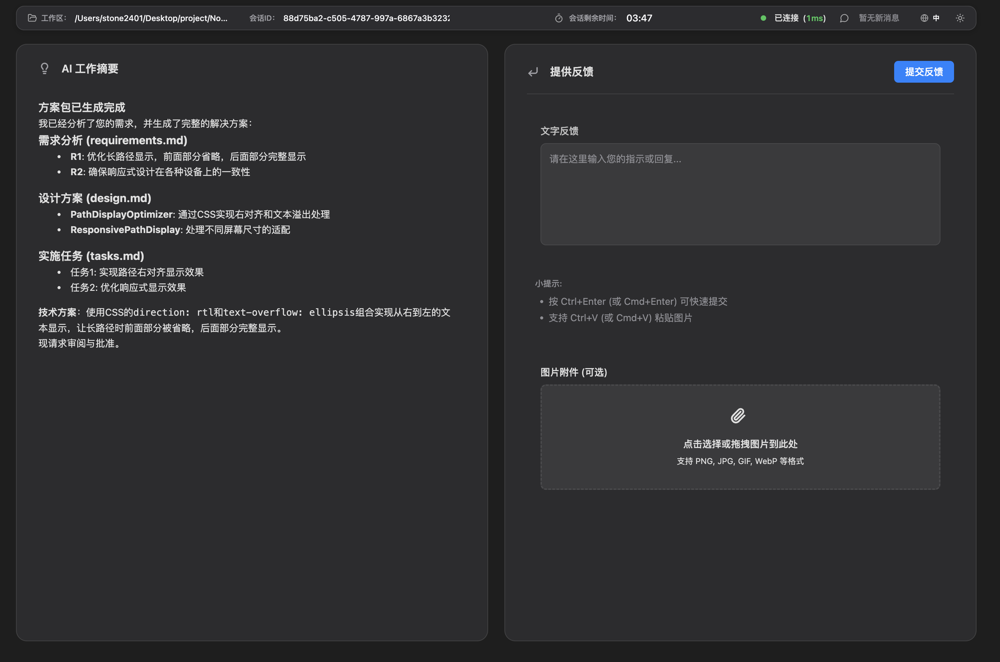

# Dynamic Interaction MCP

  

一个基于 Node.js/TypeScript 的交互式 AI 代理系统，提供功能丰富的 Web UI，用于实现 AI 模型与用户之间的实时、多模态交互。该工具实现了模型上下文协议（Model Context Protocol，MCP），专为 Cursor、Windsurf 等智能开发环境设计。

## ✨ 核心特性

- **多模态交互**：支持文本和图片输入，提供实时反馈
- **双重 UI 模式**：
  - **浏览器模式**：传统 Web 界面，支持浏览器通知
  - **Electron 模式**：原生桌面应用体验，增强窗口管理
- **Web 通知系统**：浏览器原生通知确保用户不会错过重要信息，即使在后台标签页也能及时提醒
- **双重 MCP 工具**：
  - `solicit-input`：交互模式，通过 Web 界面收集用户反馈
  - `notify-user`：通知模式，向用户发送信息而无需等待响应
- **懒启动服务器**：HTTP 服务器仅在需要时启动，避免端口冲突
- **会话管理**：智能会话处理，支持超时和自动重连
- **实时通信**：基于 WebSocket 的前后端实时更新
- **响应式 UI**：现代化、简洁的界面，支持深色/浅色主题切换
- **页面可见性检测**：自动检测用户是否切换到后台标签页
- **窗口焦点管理**：需要交互时自动窗口前置（Electron 模式）

## 🛠️ 技术栈

- **后端**：Node.js、Express.js、TypeScript、WebSocket、Winston
- **前端**：TypeScript、HTML5、CSS3、Web Notifications API、Page Visibility API
- **协议**：模型上下文协议 (MCP)
- **库依赖**：marked.js、highlight.js、lucide 图标

## ⚡ 快速开始

### 环境要求

- [Node.js](https://nodejs.org/) (版本 18+ 必需)
- [pnpm](https://pnpm.io/) (推荐包管理器)

### 安装方式

1. **全局安装包：**
   ```bash
   npm install -g dynamic-interaction
   ```

2. **支持 Electron GUI（可选）：**
   ```bash
   npm install -g dynamic-interaction electron
   ```

3. **或从源码安装：**
   ```bash
   git clone https://github.com/stone2401/dynamic-interaction.git
   cd dynamic-interaction
   pnpm install
   
   # 支持 Electron
   pnpm install electron --save-optional
   
   pnpm run build
   make link  # 链接为全局 CLI 工具
   ```

**注意**：Electron 是可选依赖。系统在没有安装 Electron 的情况下可以完美运行在浏览器模式。

### 使用方法

**作为 MCP 服务器：**
在你的 MCP 客户端配置中添加（如 Claude Desktop）：

```json
{
    "dynamic-interaction": {
      "command": "npx",
      "args": [
        "-y",
        "dynamic-interaction@latest"
      ],
      "env": {}
    },
}
```

AI Rule 中添加如下内容：

```Rule
- **交互通道**：所有与用户的交互都必须通过 `dynamic-interaction` 接口进行。
  - **输入请求 (`solicit-input`)**：这是 AI 发起所有交互的 **唯一** 方式。无论是请求审批、报告障碍、寻求指导，还是在任务完成后请求结束对话，都必须通过此接口。调用后，AI 必须暂停并等待用户响应。
  - **用户通知 (`notify-user`)**：此接口用于向用户发送无需其立即回应的单向通知，如中途进度更新。调用后，AI 无需等待即可继续执行。
  - **任务关闭约束**：AI **严禁**单方面决定结束当前对话或任务。所有任务完成后，必须通过 `solicit-input` 接
```



**直接 CLI 使用：**
```bash
# 启动 MCP 服务器（浏览器模式）
dynamic-interaction

# 启动 Electron 模式
UI_MODE=electron dynamic-interaction

# 开发模式
pnpm run dev

# 开发模式（Electron）
pnpm run dev:electron

# 构建项目
pnpm run build

# 启动 Electron（构建后）
pnpm run start:electron
```

## 🔧 配置选项

环境变量可以通过 `.env` 文件或直接导出配置：

### 基础配置

| 变量名             | 描述                          | 默认值       |
| ------------------ | ----------------------------- | ------------ |
| `PORT`             | HTTP 服务器端口               | `10086`      |
| `SESSION_TIMEOUT`  | 会话超时时间（秒）            | `300`        |
| `DEFAULT_LANGUAGE` | 默认界面语言（`zh`、`en` 等） | `zh`         |
| `TIMEOUT_PROMPT`   | 会话超时时的默认提示          | `"continue"` |

### Electron GUI 配置

| 变量名                     | 描述                           | 默认值      |
| -------------------------- | ------------------------------ | ----------- |
| `UI_MODE`                  | UI 模式（"browser" 或 "electron"） | `"browser"` |
| `ELECTRON_WINDOW_WIDTH`    | Electron 窗口宽度              | `1200`      |
| `ELECTRON_WINDOW_HEIGHT`   | Electron 窗口高度              | `800`       |

**注意**：Electron 模式需要安装 Electron 作为可选依赖。如果 Electron 不可用，系统将自动回退到浏览器模式并显示警告信息。

### 日志配置

| 变量名              | 描述                                                      | 默认值                        |
| ------------------- | --------------------------------------------------------- | ----------------------------- |
| `LOG_ENABLED`       | 启用日志系统                                              | `false`                       |
| `LOG_DIR`           | 日志文件存储目录                                          | `~/.dynamic-interaction/logs` |
| `LOG_ERROR_FILE`    | 错误日志文件名                                            | `error.log`                   |
| `LOG_COMBINED_FILE` | 综合日志文件名                                            | `combined.log`                |
| `LOG_LEVEL`         | 日志级别 (error, warn, info, http, verbose, debug, silly) | `info`                        |
| `LOG_COLORIZE`      | 控制台输出彩色日志                                        | `true`                        |
| `LOG_TO_FILE`       | 将日志输出到文件（需要 LOG_ENABLED=true）                 | `true`                        |

**配置示例：**
```bash
# 浏览器模式（默认）
PORT=8080 LOG_ENABLED=true DEFAULT_LANGUAGE=en dynamic-interaction

# Electron 模式，自定义窗口大小
UI_MODE=electron ELECTRON_WINDOW_WIDTH=1400 ELECTRON_WINDOW_HEIGHT=900 dynamic-interaction

# 使用 .env 文件配置
cat > .env << EOF
UI_MODE=electron
ELECTRON_WINDOW_WIDTH=1400
ELECTRON_WINDOW_HEIGHT=900
LOG_ENABLED=true
LOG_LEVEL=info
DEFAULT_LANGUAGE=zh
EOF
dynamic-interaction
```

**MCP 客户端配置示例：**
```json
// Claude Desktop config.json
{
  "mcpServers": {
    "dynamic-interaction": {
      "command": "npx",
      "args": ["-y", "dynamic-interaction@latest"],
      "env": {
        "UI_MODE": "electron",
        "ELECTRON_WINDOW_WIDTH": "1400",
        "ELECTRON_WINDOW_HEIGHT": "900",
        "DEFAULT_LANGUAGE": "zh"
      }
    }
  }
}
```

## 🌟 主要功能详解

### UI 模式

**浏览器模式（默认）**
- 传统 Web 界面，在默认浏览器中打开
- 支持浏览器通知，后台感知
- 跨平台兼容性
- 无需额外依赖

**Electron 模式**
- 原生桌面应用体验
- 增强的窗口管理和焦点控制
- 自动窗口定位和大小调整
- 更好的桌面环境集成
- 需要 Electron 作为可选依赖
- Electron 不可用时自动回退到浏览器模式
- 多个交互会话复用同一实例
- 通过上下文隔离提高安全性

### Web 通知系统
系统提供全面的通知支持：
- **浏览器通知**：当标签页在后台时显示原生浏览器通知
- **权限管理**：自动请求权限并检查状态
- **页面可见性检测**：使用 Page Visibility API 检测用户是否切换标签页
- **智能通知逻辑**：仅在页面不可见时显示浏览器通知

### MCP 工具

1. **solicit-input（交互模式）**
   - 打开交互式界面（浏览器或 Electron，基于 UI_MODE）
   - 支持文本和图片输入
   - 实时会话管理
   - 超时自动清理
   - Electron 模式下的窗口焦点管理

2. **notify-user（通知模式）**
   - 发送通知而不等待用户输入
   - 为后台用户显示浏览器通知（浏览器模式）
   - Electron 模式下的窗口焦点提醒
   - 可自定义通知内容

### 架构亮点

- **模块化设计**：MCP 服务器、HTTP 服务器和 WebSocket 传输层清晰分离
- **会话管理**：智能会话处理，支持超时和清理
- **状态管理**：集中式服务器状态管理
- **错误处理**：全面的错误处理和优雅降级
- **安全性**：输入验证和清理

## 📁 项目结构

```
src/
├── mcp/                # MCP 服务器实现
│   ├── index.ts        # MCP 服务器配置和工具注册
│   └── solicit-input.ts # 用户输入请求和通知功能
├── server/             # HTTP 服务器和 WebSocket 处理
│   ├── core/           # 服务器核心组件
│   ├── messaging/      # 消息处理和路由
│   ├── session/        # 会话管理
│   ├── websocket/      # WebSocket 连接管理
│   └── notifications/  # 通知存储
├── electron/           # Electron 桌面应用
│   ├── main.ts         # Electron 主进程
│   ├── window-manager.ts # 窗口管理
│   ├── lifecycle.ts    # 应用生命周期
│   ├── launcher.ts     # Electron 启动器服务
│   └── preload.ts      # 安全预加载脚本
├── public/             # 前端资源
│   ├── ts/             # TypeScript 前端代码
│   │   ├── services/   # WebSocket 通信、通知、主题
│   │   ├── components/ # UI 组件（模态框、状态栏、反馈表单）
│   │   ├── utils/      # 助手函数和 DOM 工具
│   │   └── core/       # 应用核心、事件系统、类型定义
│   ├── css/            # 样式表
│   └── index.html      # 主 UI
├── types/              # 共享 TypeScript 接口
├── utils/              # 工具函数
└── config.ts           # 配置管理
```

## 🚀 开发指南

### 构建命令

```bash
# 安装依赖
pnpm install

# 开发模式（热重载）
pnpm run dev

# 开发模式（Electron）
NODE_ENV=development UI_MODE=electron pnpm run dev

# 生产构建
pnpm run build

# 启动构建后的应用
pnpm start

# 启动 Electron 模式
UI_MODE=electron pnpm start

# 使用 Makefile 的替代构建方式
make build
make start
```

### 故障排除

**Electron 模式无法工作：**
```bash
# 检查 Electron 是否已安装
electron --version

# 如果未安装，进行安装
npm install -g electron

# 验证配置
echo $UI_MODE  # 应该是 "electron"
```

**窗口大小问题：**
```bash
# 检查配置值
echo $ELECTRON_WINDOW_WIDTH
echo $ELECTRON_WINDOW_HEIGHT

# 设置有效值（仅数字）
export ELECTRON_WINDOW_WIDTH=1200
export ELECTRON_WINDOW_HEIGHT=800
```

**详细故障排除请参阅 [故障排除指南](../guides/electron-troubleshooting.md)**

### 前端开发

前端使用模块化 TypeScript 架构：
- **服务**：WebSocket 通信、通知、主题管理
- **组件**：UI 组件如模态框、状态栏、反馈表单
- **工具**：助手函数和 DOM 工具
- **核心**：应用核心、事件系统和类型定义

### 构建流程

构建过程包含多个步骤：

1. **后端 TypeScript 编译**：`tsc`
2. **前端 TypeScript 编译**：`tsc --project tsconfig.frontend.json`
3. **资源复制和组织**：`copy-assets` 脚本
4. **CLI 文件可执行权限设置**

## 🔍 工作原理

### 懒启动机制
- MCP 服务器始终运行，监听来自 AI 客户端的工具调用
- HTTP 服务器仅在调用 MCP 工具时启动
- 避免不必要的资源占用和端口冲突

### 会话流程
1. AI 调用 `solicit-input` 或 `notify-user` 工具
2. 系统检查是否有活跃的 WebSocket 连接
3. 如无连接，自动打开浏览器窗口到 Web UI
4. 用户通过 Web 界面提供反馈
5. 反馈通过 WebSocket 返回给 MCP 服务器
6. MCP 服务器将结果返回给 AI 客户端

### 通知系统
- 使用 Page Visibility API 检测标签页状态
- 在页面不可见时自动显示浏览器通知
- 自动请求和管理通知权限
- 点击通知可将焦点返回到应用页面

## 📚 文档资源

### 核心文档
- [开发指南](./DEVELOPMENT.md) - 开发设置和指导原则
- [English Documentation](../README.md) - English documentation

### Electron GUI 文档
- [Electron 设置指南](./guides/electron-setup-guide.md) - 完整安装和设置指南
- [配置参考](./guides/electron-configuration.md) - 所有配置选项和示例
- [故障排除指南](./guides/electron-troubleshooting.md) - 常见问题和解决方案
- [安全指南](./guides/electron-security.md) - 安全考虑和最佳实践

### 其他指南
- [Web 通知指南](./guides/web-notifications-guide.md) - 浏览器通知设置
- [功能规范](./specs/) - 详细功能规范和设计

## 🤝 贡献指南

我们欢迎任何形式的贡献！请随时提交 Pull Request 或创建 Issue。

## 📄 许可证

本项目基于 [MIT License](../LICENSE) 开源。

## 🙏 致谢

为 AI 开发社区构建，旨在增强现代开发工作流程中的人机交互体验。